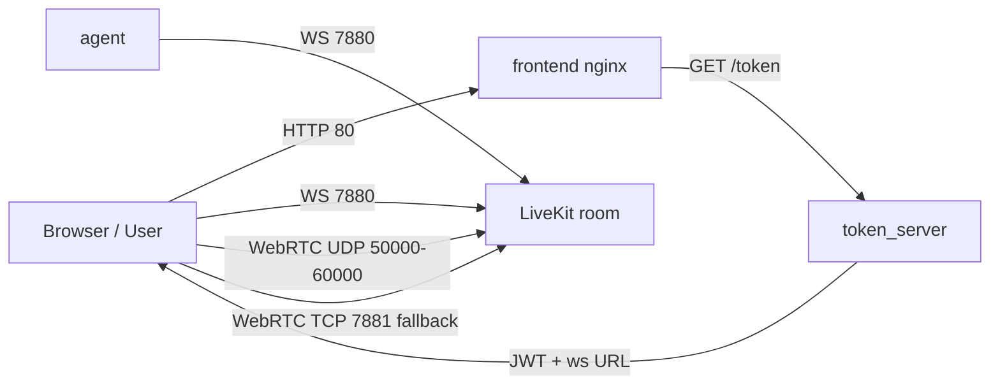

# LiveKit Transport-First Scaffold

Минимальный каркас для transport-check перед AI voice loop.

На этом этапе цель только такая:

1. Браузер заходит в комнату.
2. Агент заходит в ту же комнату.
3. Frontend видит `agent-001`.
4. Frontend получает `agent_ready`.
5. Агент видит audio track пользователя.
6. Агент умеет отправлять data-message обратно.

Сейчас сознательно не делаем:

- Caddy
- WSS/TLS
- TURN/TLS
- доменную production-маршрутизацию
- сложный production perimeter

Это отдельный этап после первого рабочего AI loop.

## Что есть в репозитории

- `docker-compose.yml` — локальный smoke-test
- `docker-compose.prod.yml` — public-IP baseline для Ubuntu
- `token_server` на FastAPI
- простой `frontend` без React
- Python `agent`, который входит в комнату и отправляет `agent_ready`
- bootstrap/user-data скрипты

## Структура

```text
.
├── .env.example
├── .env.prod.example
├── docker-compose.yml
├── docker-compose.prod.yml
├── README.md
├── token_server/
│   ├── main.py
│   ├── requirements.txt
│   └── Dockerfile
├── agent/
│   ├── main.py
│   ├── requirements.txt
│   └── Dockerfile
├── frontend/
│   ├── index.html
│   ├── nginx.conf
│   └── nginx.prod.conf
└── scripts/
    ├── bootstrap_server.sh
    ├── check_gpu.sh
    ├── open_ports.sh
    ├── user-data.sh
    └── user-data.cloud-config.yaml
```

## Режимы запуска

### 1. Локальный smoke-test

Файл: [docker-compose.yml](/Users/dr_emin/Desktop/livekit/docker-compose.yml)

URL:

- frontend: `http://localhost:8080`
- token server: `http://localhost:8000`
- LiveKit: `ws://localhost:7880`

Запуск:

```bash
cd /Users/dr_emin/Desktop/livekit
cp .env.example .env
docker compose up --build
```

### 2. Ubuntu public-IP baseline

Файл: [docker-compose.prod.yml](/Users/dr_emin/Desktop/livekit/docker-compose.prod.yml)

Сейчас это основной серверный режим для проверки транспорта.

URL:

- frontend: `http://193.39.168.244`
- token server через frontend: `http://193.39.168.244/token`
- health: `http://193.39.168.244/healthz`
- LiveKit: `ws://193.39.168.244:7880`

## Схема baseline



Что важно:

- frontend отдается по обычному `http://`
- token server наружу напрямую не нужен, frontend проксирует `/token`
- browser подключается к LiveKit напрямую по `ws://PUBLIC_IP:7880`
- этого достаточно для первого AI transport-check

## Production baseline на Ubuntu 24.04

Минимальный `.env`:

```env
SERVER_TIMEZONE=Europe/Moscow
SERVER_PUBLIC_IP=193.39.168.244
LIVEKIT_API_KEY=voice-agent-prod
LIVEKIT_API_SECRET=replace-with-long-random-secret
LIVEKIT_URL_PUBLIC=ws://193.39.168.244:7880
LIVEKIT_USE_EXTERNAL_IP=true
TOKEN_TTL_MINUTES=60
CORS_ALLOW_ORIGINS=*
AGENT_ROOM=demo-room
AGENT_IDENTITY=agent-001
AGENT_NAME=Room Agent
AGENT_READY_TOPIC=presence
TOKEN_REQUEST_TIMEOUT=10
```

Запуск:

```bash
cd /opt/voice-agent
cp .env.prod.example .env
docker compose -f docker-compose.prod.yml up --build -d
```

## Порты

Для baseline-сервера должны быть доступны:

- `80/tcp` — frontend
- `7880/tcp` — LiveKit signal
- `7881/tcp` — WebRTC TCP fallback
- `3478/udp` — можно открыть заранее
- `50000-60000/udp` — media traffic

`443` можно оставить открытым заранее, но текущий baseline его не использует.

## Проверка

1. Откройте `http://193.39.168.244`.
2. Нажмите `Join`.
3. Проверьте, что frontend подключился к комнате.
4. Проверьте, что в participants виден `agent-001`.
5. Проверьте, что в логе есть `agent_ready`.
6. Включите `Mic On`.
7. Убедитесь по логам агента, что он подписался на пользовательский audio track.
8. Проверьте, что frontend получил data-message `user_audio_track_detected:<identity>` на topic `agent_status`.

## Что делаем сразу после этого

После transport-check переходим в AI loop:

1. Получение аудиофреймов от пользователя.
2. VAD на аудиопотоке.
3. Буферизация utterance.
4. STT.
5. Keyword/intent router без LLM для простых команд.
6. LLM только для сложных запросов.
7. TTS с разметкой.
8. Публикация аудиоответа обратно в LiveKit.

## Token API

### `GET /healthz`

```json
{
  "status": "ok"
}
```

### `GET /token?room=demo-room&identity=user-123`

```json
{
  "url": "ws://193.39.168.244:7880",
  "token": "<jwt>",
  "room": "demo-room",
  "identity": "user-123"
}
```
