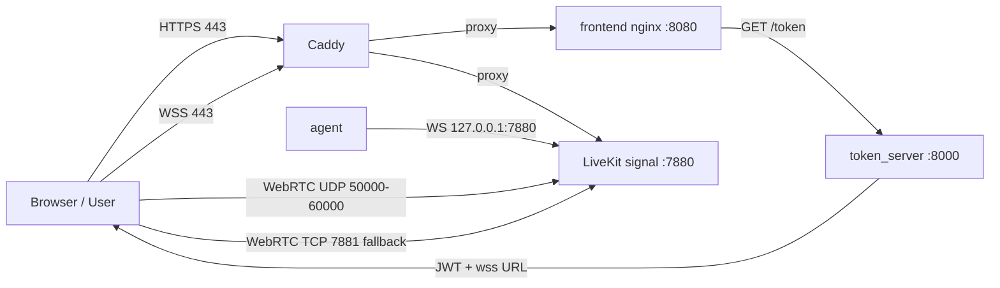

# LiveKit Transport-First Scaffold

Минимальный каркас для transport-check и первого browser-safe AI voice loop.

Текущая цель:

1. Браузер заходит в комнату по `https://app.example.com`.
2. Агент заходит в ту же комнату.
3. Frontend видит `agent-001`.
4. Frontend получает `agent_ready`.
5. Агент видит audio track пользователя.
6. Агент умеет отправлять data-message обратно.

Что сознательно не делаем на этом этапе:

- TURN/TLS
- отдельный `turn.example.com`
- полный production perimeter
- multi-node routing
- прикладной AI orchestration поверх транспорта
- автоматическое управление `ufw` из repo-скриптов

## Что есть в репозитории

- `docker-compose.yml` — локальный smoke-test
- `docker-compose.prod.yml` — доменный baseline для Ubuntu
- `token_server` на FastAPI
- простой `frontend` без React
- Python `agent`, который входит в комнату и отправляет `agent_ready`
- agent-side audio receiver для remote microphone track
- streaming VAD + utterance buffer
- STT + normalization + simple intent router
- text-first LLM REPL for prompt/state debugging without STT/TTS
- bootstrap/user-data скрипты
- `Caddy` для HTTPS и WSS

Важно:

- firewall на сервере управляется вручную;
- `scripts/bootstrap_server.sh` не должен включать или настраивать `ufw`.

## Структура

```text
.
├── .env.example
├── .env.prod.example
├── docker-compose.yml
├── docker-compose.prod.yml
├── docker-compose.gpu.yml
├── README.md
├── token_server/
│   ├── main.py
│   ├── requirements.txt
│   └── Dockerfile
├── agent/
│   ├── main.py
│   ├── requirements.txt
│   └── Dockerfile
├── frontend/
│   ├── index.html
│   ├── nginx.conf
│   └── nginx.prod.conf
└── scripts/
    ├── bootstrap_server.sh
    ├── check_gpu.sh
    ├── open_ports.sh
    ├── user-data.sh
    └── user-data.cloud-config.yaml
```

## Режимы запуска

### 1. Локальный smoke-test

Файл: [docker-compose.yml](/Users/dr_emin/Desktop/livekit/docker-compose.yml)

URL:

- frontend: `http://localhost:8080`
- token server: `http://localhost:8000`
- LiveKit: `ws://localhost:7880`

Запуск:

```bash
cd /Users/dr_emin/Desktop/livekit
cp .env.example .env
docker compose up --build
```

### Text-first LLM debug mode

Если нужно быстро проверить именно память, state summary и prompt без голосового контура:

```bash
cd /Users/dr_emin/Desktop/livekit/agent
python3 text_llm_cli.py
```

Команды:

- `/state` — показать текущее структурированное состояние звонка
- `/reset` — сбросить историю и state
- `/exit` — выйти

### HTTP text dialogue debug

Если нужно отдельно качать именно диалоговую модель через `curl`, без LiveKit/STT/TTS:

```bash
cd /Users/dr_emin/Desktop/livekit
cp .env.prod.example .env
docker compose -f docker-compose.prod.yml -f docker-compose.gpu.yml up -d --build llm text_llm
```

Проверка:

```bash
curl -s http://127.0.0.1:8787/healthz
```

Cold-start сессия: на старте известен только номер телефона.

```bash
curl -s http://127.0.0.1:8787/session/start \
  -H 'Content-Type: application/json' \
  -d '{
    "session_id": "call-001",
    "phone": "+79990000000"
  }'
```

Следующая реплика клиента:

```bash
curl -s http://127.0.0.1:8787/session/message \
  -H 'Content-Type: application/json' \
  -d '{
    "session_id": "call-001",
    "text": "ну я слушаю, кто вы и что хотите"
  }'
```

Ещё ход:

```bash
curl -s http://127.0.0.1:8787/session/message \
  -H 'Content-Type: application/json' \
  -d '{
    "session_id": "call-001",
    "text": "удобно да, но я не на покупку интересуюсь"
  }'
```

Проверка отказа раскрывать лишнее:

```bash
curl -s http://127.0.0.1:8787/session/message \
  -H 'Content-Type: application/json' \
  -d '{
    "session_id": "call-001",
    "text": "ну это не так важно, не хочу разглашать"
  }'
```

Проверка ветки без недвижимости:

```bash
curl -s http://127.0.0.1:8787/session/message \
  -H 'Content-Type: application/json' \
  -d '{
    "session_id": "call-001",
    "text": "недвижимости нет"
  }'
```

Состояние сессии:

```bash
curl -s 'http://127.0.0.1:8787/session/state?session_id=call-001'
```

Сброс:

```bash
curl -s http://127.0.0.1:8787/session/reset \
  -H 'Content-Type: application/json' \
  -d '{"session_id":"call-001"}'
```

### 2. Ubuntu domain baseline

Файл: [docker-compose.prod.yml](/Users/dr_emin/Desktop/livekit/docker-compose.prod.yml)

Сейчас это основной серверный режим для проверки транспорта и микрофона без `localhost` tunnel.

URL:

- frontend: `https://app.example.com`
- token server через frontend: `https://app.example.com/token`
- health: `https://app.example.com/healthz`
- LiveKit: `wss://livekit.example.com`

## Схема baseline



Что важно:

- frontend отдается по `https://app.example.com`
- token server наружу напрямую не нужен, frontend проксирует `/token`
- browser получает secure context и может запрашивать микрофон без tunnel
- signal идет через `wss://livekit.example.com`
- media по-прежнему идет напрямую в LiveKit по UDP/TCP

## DNS

Для этого baseline нужны две A-записи:

- `app.example.com -> 203.0.113.10`
- `livekit.example.com -> 203.0.113.10`

`turn.example.com` пока не нужен.

## Domain baseline на Ubuntu 24.04

Минимальный `.env`:

```env
SERVER_TIMEZONE=Europe/Moscow
SERVER_PUBLIC_IP=203.0.113.10
APP_DOMAIN=app.example.com
LIVEKIT_DOMAIN=livekit.example.com
LIVEKIT_API_KEY=voice-agent-prod
LIVEKIT_API_SECRET=replace-with-long-random-secret
LIVEKIT_URL_PUBLIC=wss://livekit.example.com
LIVEKIT_USE_EXTERNAL_IP=true
TOKEN_TTL_MINUTES=60
CORS_ALLOW_ORIGINS=*
AGENT_ROOM=demo-room
AGENT_IDENTITY=agent-001
AGENT_NAME=Room Agent
AGENT_READY_TOPIC=presence
TOKEN_REQUEST_TIMEOUT=10
CONNECT_RETRY_DELAY=2
AGENT_EVENTS_TOPIC=agent_events

MODEL_CACHE_DIR=/opt/models
VOICE_AGENT_DATA_DIR=/opt/voice-agent-data

AUDIO_SAMPLE_RATE=16000
AUDIO_NUM_CHANNELS=1
AUDIO_FRAME_SIZE_MS=20

VAD_THRESHOLD=0.45
VAD_MIN_SPEECH_DURATION_MS=200
VAD_MIN_SILENCE_DURATION_MS=500
VAD_SPEECH_PAD_MS=120
VAD_USE_ONNX=false
TORCH_NUM_THREADS=1

STT_ENABLED=true
STT_MODEL=Systran/faster-whisper-small
STT_DEVICE=auto
STT_COMPUTE_TYPE_CPU=int8
STT_COMPUTE_TYPE_GPU=float16
STT_LANGUAGE=ru
STT_BEAM_SIZE=1
STT_CONFIDENCE_FLOOR=0.35
```

Запуск:

```bash
cd /opt/voice-agent
cp .env.prod.example .env
docker compose -f docker-compose.prod.yml up --build -d
```

### 3. GPU override

Файл: [docker-compose.gpu.yml](/Users/dr_emin/Desktop/livekit/docker-compose.gpu.yml)

Используйте его только если:

- на хосте есть NVIDIA GPU
- `nvidia-smi` работает
- установлен `nvidia-container-toolkit`

Запуск:

```bash
cd /opt/voice-agent
cp .env.prod.example .env
docker compose -f docker-compose.prod.yml -f docker-compose.gpu.yml up --build -d
```

## Порты

Для domain baseline должны быть доступны:

- `80/tcp` — ACME / HTTP challenge
- `443/tcp` — HTTPS frontend и WSS signal
- `7881/tcp` — WebRTC TCP fallback
- `50000-60000/udp` — media traffic

`3478/udp` можно держать открытым заранее, но текущая конфигурация его не использует.
`7880/tcp` снаружи больше не нужен. По LiveKit docs этот порт должен быть за SSL termination layer, а наружу для клиентов нужен `wss://...` endpoint.

## Проверка

1. Откройте `https://app.example.com`.
2. Нажмите `Join`.
3. Проверьте, что frontend подключился к комнате.
4. Проверьте, что в participants виден `agent-001`.
5. Проверьте, что в логе есть `agent_ready`.
6. Включите `Mic On`.
7. Убедитесь по логам агента, что он подписался на пользовательский audio track.
8. Проверьте, что frontend получил data-message `user_audio_track_detected:<identity>` на topic `agent_status`.

## Что делаем сразу после этого

После transport-check идем по AI loop в таком порядке:

1. Получение аудиофреймов от пользователя.
2. VAD на аудиопотоке.
3. Буферизация utterance.
4. STT.
5. Keyword/intent router без LLM для простых команд.
6. LLM только для сложных запросов.
7. TTS с разметкой.
8. Публикация аудиоответа обратно в LiveKit.

Сейчас в репозитории уже реализованы первые 5 пунктов в виде MVP-контура:

- agent получает PCM audio frames из LiveKit
- VAD режет поток на utterance
- utterance сохраняются в `/tmp/voice-agent/utterances`
- faster-whisper возвращает transcript
- transcript нормализуется и идет в простой router
- frontend получает data-events:
  - `agent_status`
  - `speech_detected`
  - `utterance_finalized`
  - `transcript`
  - `intent`
  - `agent_response_text`

Что еще не реализовано:

- реальный LLM fallback
- TTS layer
- публикация голосового ответа обратно в LiveKit
- half-duplex speaking lock

## Models And GPU

Базовый STT по умолчанию:

- `Systran/faster-whisper-small`

Почему так:

- это самый быстрый путь к рабочему русскоязычному loop без сложной инфраструктуры
- модель можно заменить позже на `medium` или другой backend без слома интерфейса

Текущее поведение по GPU:

- VAD остается легким и может спокойно жить на CPU
- STT пытается использовать `cuda`, если `STT_DEVICE=auto` и внутри контейнера реально доступна NVIDIA runtime
- если CUDA недоступна или инициализация падает, agent автоматически откатывается на CPU `int8`
- для реального проброса GPU в контейнер используйте `docker-compose.gpu.yml`

Проверка сервера:

```bash
./scripts/check_gpu.sh
```

Если хотите кэшировать модели на сервере, compose уже монтирует:

- `${MODEL_CACHE_DIR}` -> `/models`
- `${VOICE_AGENT_DATA_DIR}` -> `/tmp/voice-agent`

Пример preload на сервере:

```bash
pip install -U "huggingface_hub[cli]"
huggingface-cli download Systran/faster-whisper-small --local-dir /opt/models/faster-whisper-small
```

Тогда в `.env` можно указать:

```env
STT_MODEL=/models/faster-whisper-small
```

## Token API

### `GET /healthz`

```json
{
  "status": "ok"
}
```

### `GET /token?room=demo-room&identity=user-123`

```json
{
  "url": "wss://livekit.example.com",
  "token": "<jwt>",
  "room": "demo-room",
  "identity": "user-123"
}
```

## Источники

По официальной документации LiveKit secure deployment требует домен, SSL termination и `wss://` endpoint для SDK-клиентов:

- [Deployment](https://docs.livekit.io/home/self-hosting/deployment/)
- [Virtual machines](https://docs.livekit.io/transport/self-hosting/vm/)
- [Ports and firewall](https://docs.livekit.io/transport/self-hosting/ports-firewall/)
